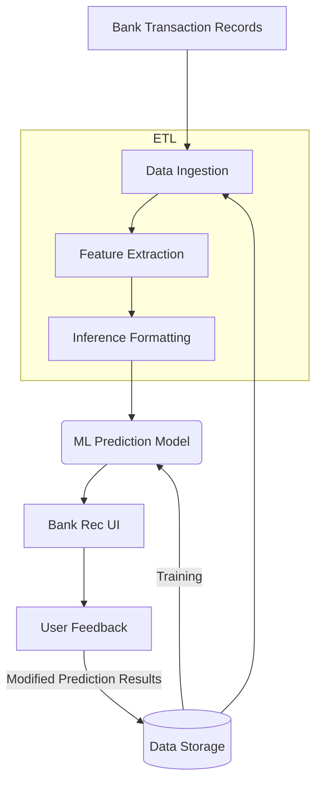
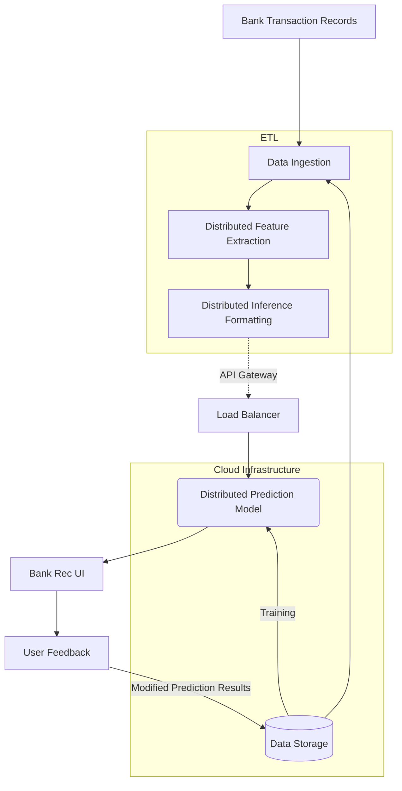

## Transient Analysis
- Initial System response to $\Delta$ 
- Dies off exponentially

## Steady-State Response
-  When Transients "die out" as $t\to\infty$

## First-Order Circuit 
- With just one storage element

## The following are continuous @ $t=0$
- Voltage for [[Capacitors]]
- Current for [[Inductors]]

## Analyzing these circuits in the form: ([[Homogenous Linear DEs]]):
$$\frac{dy}{dt}+\frac{y}{\tau}=0$$
Where $\tau=RC$.
## Our General Solution Will Look Like:
$$y=c_1e^{-\frac{1}{\tau}t}$$
Where $c_1$ will arise from the initial condition.

