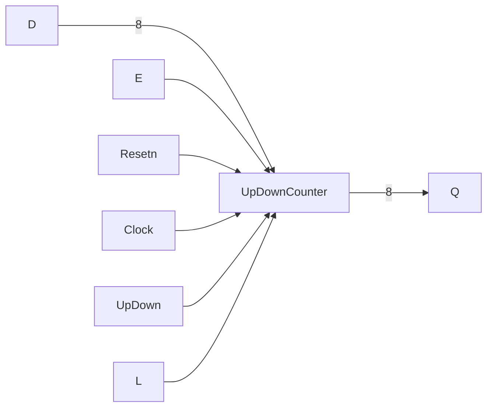

## Binary Up-Counters
We can make use of Toggle [[Flip-Flops]]:
![[IMG_333CA8F38A61-1.jpeg]]
![[IMG_E70BC32AE0FF-1.jpeg]]

## 3-Bit Synchronous Binary Counter:

|CLK|$Q_2$|$Q_1$|$Q_0$|
|---|---|---|---|
|0|0|0|0|
|1|0|0|1|
|2|0|1|0|
|3|0|1|1|
|4|1|0|0|
|5|1|0|1|
|6|1|1|0|
|7|1|1|1|
|8 (Repeat)|0|0|0|

![[IMG_850A9F9F30E4-1.jpeg]]

## Signal-Enabled Counter

![[IMG_3B0D23250597-1.jpeg]]
## [[Verilog]] Implementation of a Signal-Enabled Counter:

- 8bit up/down counter with Synchronous Active Low Reset
- Active High Enable and parallel load.

```verilog
module UpDownCounter(D, Resetn, Clock, E, L, UpDown, Q);

	parameter n=8;
	input [n-1:0] D;
	input Resetn, Clock, E, L, UpDown;
	output reg [n-1:0] Q;
	
	always@(posedge Clock) begin
		if (!Resetn) // Active low
			Q <= 0;
		else if (L)
			Q <= D;
		else if (E)
			Q <= Q+(UpDown ? 1 : -1);
	end
endmodule
```



## Binary-Coded Decimal (BCD) Counter:

![[IMG_3984AA50AAA0-1.jpeg]]
