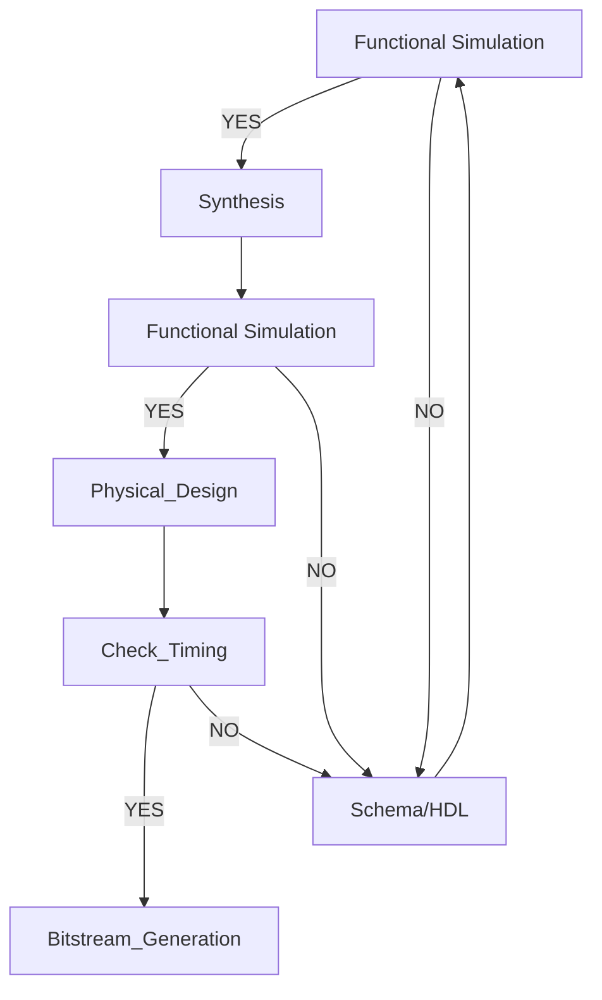

## Architecture with [[Look-Up Tables]]:
![[Untitled (2).png]]

FPGA Computer-Aided Design Workflow (CAD), Functional Simulations with [[Verilog]]:

```mermaid
graph TD
f1["Functional Simulation"]
f2["Functional Simulation"]

  Schema/HDL --> f1
	f1 --YES--> Synthesis
	f1 --NO--> Schema/HDL
	Synthesis --> f2
	f2 --YES--> Physical_Design
	f2 --NO--> Schema/HDL
	Physical_Design --> Check_Timing
	Check_Timing --YES---> Bitstream_Generation
	Check_Timing --NO--> Schema/HDL

```