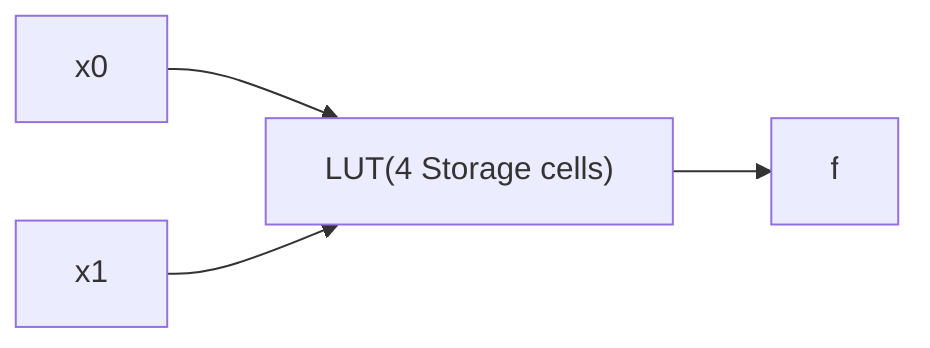
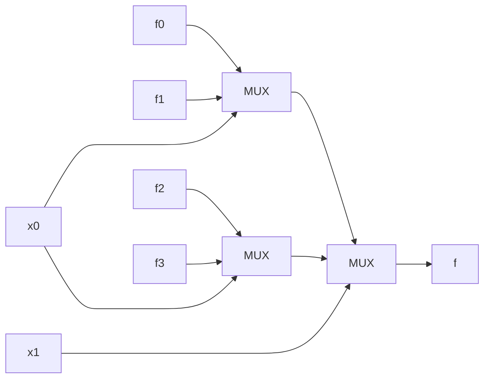

## LUTs

- Building logic function by programming some storage cells:
- Can implement any n-input logic function with any kind of [[Complex Logic Gates]].

$$ n_{cells}=2^{n_{inputs}} $$

## 2-LUT (2-input) Implementation with [[Multiplexers]]

- Where `[3:0] f` are Memory Cells storing 0 or 1.

$$ n_{MUX}=2^{n_{inputs}}-1 $$

### FPGA on DE1-SoC: ~85k 4-LUTs, 32,075 ALUs [[Arithmetic Logic Unit]]s.