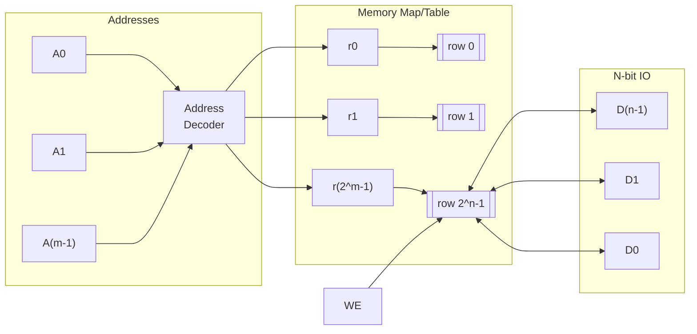
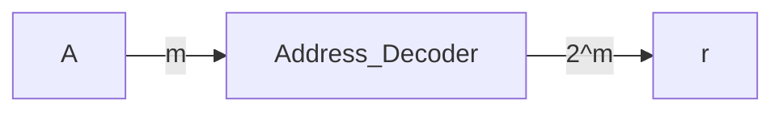
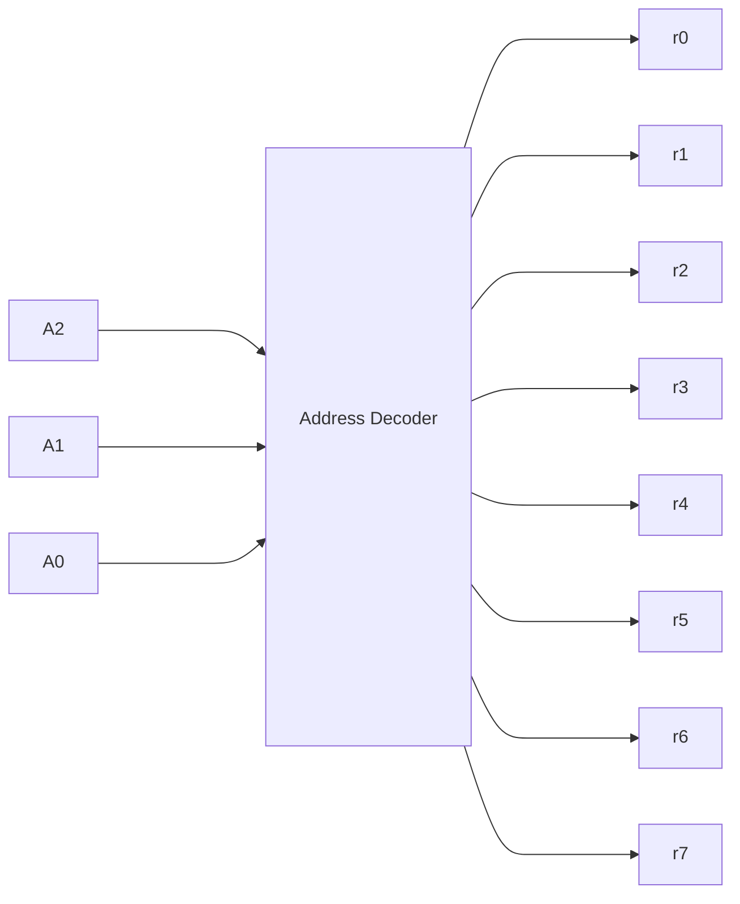

As an example, we will store _words_ in a given row. 

A few notes on the diagram:
- Only 1 given `r` signal can be turned on at a time to allow for simpler read/write of words to rows.
- `WE` (Write Enable) Is `1` when we want to write into memory, and off otherwise.

## Address Decoder Example

### We will look at a memory bank with 8 rows, thus only $\log_2(8)=3$ Address lines needed:

### We can (and always will) use [[One-Hot Encoding]] to Encode these row signals using the Address Lines, $A_i$

|$A_2$|$A_2$|$A_2$|-|$r_7$|$r_6$|$r_5$|$r_4$|$r_3$|$r_2$|$r_1$|$r_0$|
|---|---|---|---|---|---|---|---|---|---|---|---|
|0|0|0|→|0|0|0|0|0|0|0|1|
|0|0|1|→|0|0|0|0|0|0|1|0|
|0|1|0|→|0|0|0|0|0|1|0|0|
|0|1|1|→|0|0|0|0|1|0|0|0|
|1|0|0|→|0|0|0|1|0|0|0|0|
|1|0|1|→|0|0|1|0|0|0|0|0|
|1|1|0|→|0|1|0|0|0|0|0|0|
|1|1|1|→|1|0|0|0|0|0|0|0|

We can employ the use of [[Tri-State Buffer]]s to create:

## Static Memory Cells (SRAM cells)
![[Pasted image 20231030231218.png]]
### Notes on this:
- `Data_out` Allows us to read SRAM cell value.
- `Acsess` comes from an `r_i` signal of an Address Decoder. Triggers connection to SRAM
- For the SRAM cell (To right of `S`), The data is stored while power is on.
- `Data_in` is driven by the MOSFET `B` to overwrite the SRAM Cell (`A`). Done safely by low level transistor circuits.

## Memory Cell Matrix

![[Pasted image 20231030231332.png]]

The `OE` signal is rather useful since it allows us to pull data from specific cells at unique points in time.

## Synchronous Dynamic Random Access Memory (SDRAM)

![[IMG_B1F040C38FBE-1.jpeg]]

Notes on this:
- Usually an external chip
- Complicated access protocol -> sophisticated refresh cycle needed
- Need expert-made controllers to access memory through capacitor
- Instantiate IP Block to use it with [[Verilog]]

