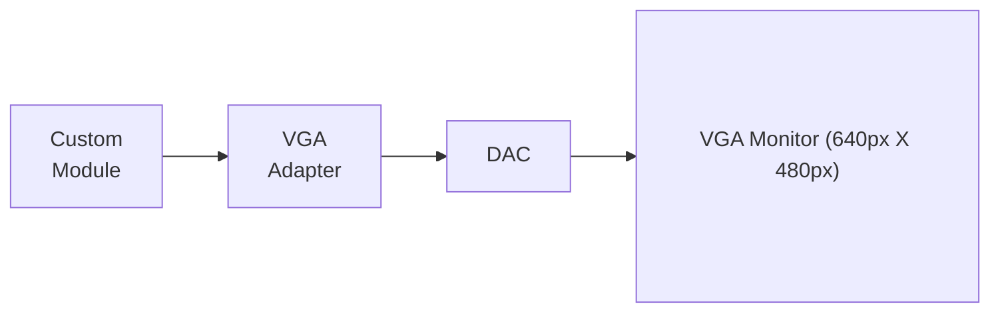
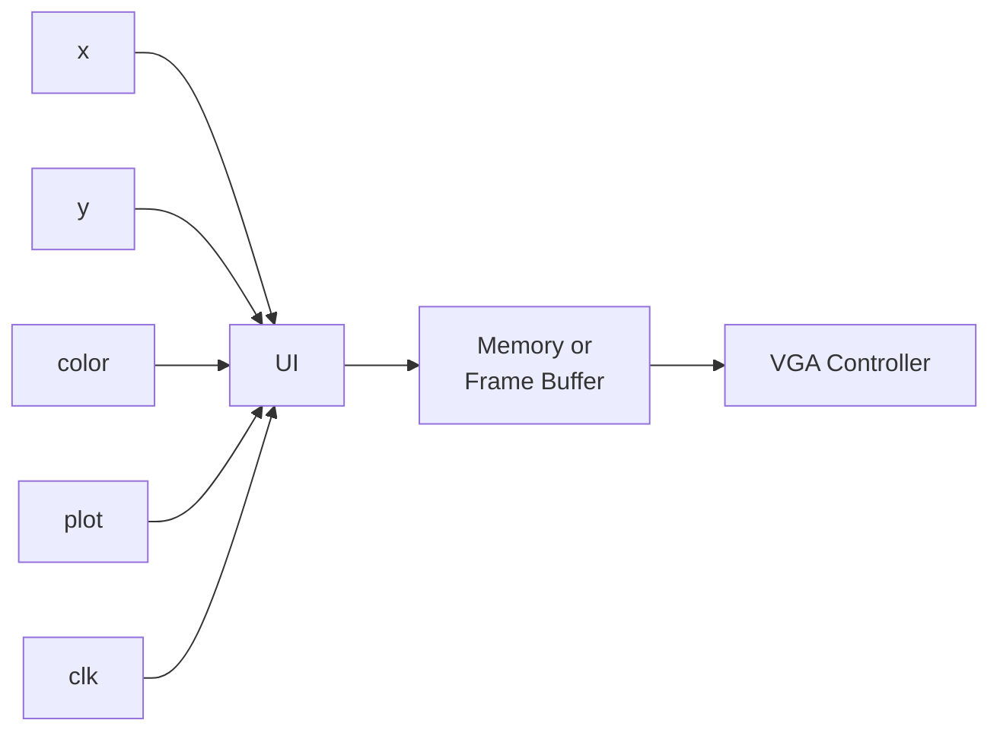
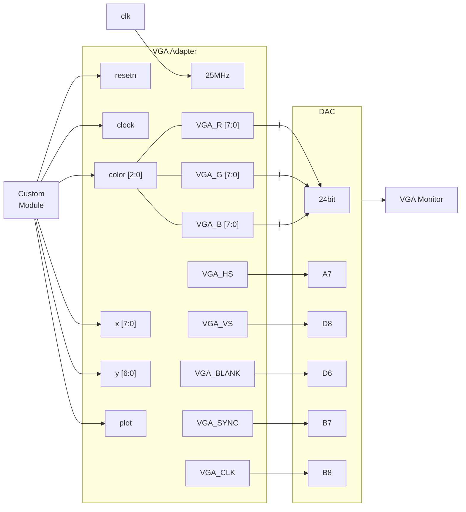

Connected to [[FPGAs]] using a VGA adapter and [[Verilog]] module.

```mermaid
graph LR
c["Custom\nModule"]
v["VGA\nAdapter"]
mn["\n\n\nVGA Monitor (640px X 480px)\n\n\n\n"]
c --> v --> DAC --> mn
```
`VGA Adapter` is pre-defined.

```mermaid
graph LR
	x --> UI
	y --> UI
	color --> UI
	plot --> UI
	clk --> UI
	UI --> m["Memory or\nFrame Buffer"]
	m --> v["VGA Controller"]
```

```mermaid
graph LR
	cm["Custom\nModule"]
	clk --> 25MHz
	cm --> resetn
	cm --> clock
	cm --> cll["color [2:0]"]
	cm --> x["x [7:0]"]
	cm --> y["y [6:0]"]
	cm --> plot
	subgraph VGA Adapter
		resetn
		clock
		cll["color [2:0]"]
		x["x [7:0]"]
		y["y [6:0]"]
		plot
		
		cll --- v1["VGA_R [7:0]"]
		cll --- v2["VGA_G [7:0]"]
		cll --- v3["VGA_B [7:0]"]
		v4["VGA_HS"]
		v5["VGA_VS"]
		v6["VGA_BLANK"]
		v7["VGA_SYNC"]
		v8["VGA_CLK"]
		
		25MHz
	end
	subgraph DAC
		v1 --I--> 24bit
		v2 --I--> 24bit
		v3 --I--> 24bit
		v4 --> A7
		v5 --> D8
		v6 --> D6
		v7 --> B7
		v8 --> B8
	end

	DAC --> vv["VGA Monitor"]
	
```
![[IMG_093082E03806-1.jpeg]]
