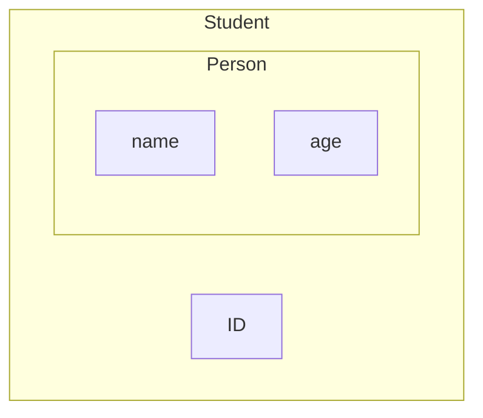

## Definition:

- Inheriting/ acquiring all attributes and properties of parent [[Classes]]
- A pillar of OOP like [[Encapsulation]].

## Person → Student Example:

```cpp
class Person{
	private:
		string name;
		int age;
	public:
		Person(){name=""; age=0;}
		Person(string n int a){name=n;age=a;}
		void setName(string n){name = n;}
		void print(){
			cout << "Name: "<< name << endl;
			cout << "Age: " << age << endl;
		}
}
```

Now, creating the implementation for `Student`, we need:

- data:
    - `name, age, ID`
- functions:
    - `setName, print, setNameID`

We could write a `Student` class from scratch, using code directly from person or use Inheritance (Inherit attributes from Person):

Benefits of Inheritance

- Modularity and being able to see code changes in the `Person` class reflected in the `Student` class.
- We need not understand the details of how Person works, only what it does.
- Code Reusability.

### Person → a _Base_ class (or Parent class)

### Student → a _Derived_ class (or Child class)

```cpp
class Student : public Person{ 
// This is it, We've just inherited everything BUT constructors from Person
	private:
		int ID;
		// Note: age and name name are inherited from Person but are as of now 
		// inaccessible since they are private members of the Person class.
	public:
		Student(){ID=0;}
		void setNameID(string n, int d){
			Person::setName(n);
			ID = d;
		}
		void setNameID(int id){
			ID = id;
		}
		void print(){
			// This is the same name/same parameters from what we inherited
			// from the Person Class
			cout<<"ID:"<< ID << endl;
			Person::print(); // This is an issue right now!
		}

}
```



Important notes:

- Instances of Student are of both type Student and Person.
    - We construct a `Person` Object and then a `Student` on top of it.

## Calling alternate Constructors from Base [[Classes]] and using them in Derived ones:

```cpp
class Student:public Person{
	private:
		int ID;
	public:
		Student(string n, int a, int d):Person(n,a){
			// We are kind of calling the specific constructor from person here,
			// Borrowing its functionality to make out life easier.
			ID=d;
		}
		//Also note we could do either of the following for dflt constrctr
		Student(){ID=0;}
		// or, equivlntly:
		Student():ID(0){}
};
```

## We want to dynamically allocate memory in derived objects:

```cpp
class Person{
	private:
		int age;
		char * name;
	public:
		Person(const Person& original){
			age = original.age;
			//shallow copy: name = original.name;
			//Deep copy:
			name = new char[strlen(original.name)+1];
			strcpy(name, original.name);
		}
		Person& operator=(const Person& rhs){
			if(&rhs==this){return *this;}
			delete [] name;
			name = new char[strlen(original.name)+1];
			strcpy(name, original.name);
			strcpy(name, rhs.name);
			age = rhs.age;
			return *this;
		}
		~Person(){delete [] name;}
};

class Student: public Person{
	private:
		int ID;
	public:
		Student(const Student& orig):Person(orig){
			ID = orig.ID;
		}
		Student& operator=(const Student& rhs){
			Person::operator=(rhs); // rhs is a person too, we can do this.
			ID = rhs.ID;
			return *this;
		}
};
```

### Recall we are not inheriting:

- `constructors`
- `operator=`
- `destructors`

## Binding

```cpp
class Polygon{
	protected:
		int width, height;
	public:
		void set(int w, int h){
			width = w;
			height = h;
		}
};
class Rectangle : public Polygon{
	public:
		int area(){
			return Polygon::width * Polygon::height; // how we access protected members.
		}
};
class Triangle : public Polygon{
	public:
		double are(){return ...;}
};

int main(){
	Polygon p;
	p.set(3,4);
	Rectangle r;
	p = r; // Totally valid since p and r are both of type Polygon and bear the same data members.
	// We cannot, however, do r=p; since the oeprator= for r will be looking for members in p that dne.
	
	Rectangle *r1;
	Polygon *p1;
	
	p1 = &r1; 
	// This is okay and we can use p1 to acess all public functions and attributes r1 has that the polygon class already has.
	// We can't do r1 = &p; for similar reasons as before.
	return 0;
}
```

## Takeaway: `derived = base;` is bad. We can’t do that. But `base = derived;` is totally fine.