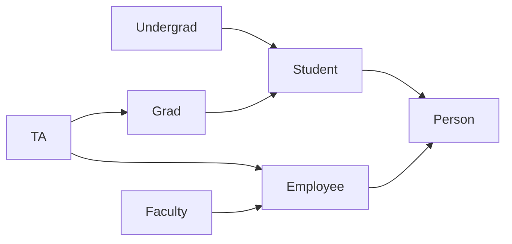

# Consider a hierarchy of [[Classes]]:



### And the associated implementation pseudo:

```cpp
class Person{
};
class Student:public Person{
};
class Employee:public Person{
};
class Grad:public Student{
};
class TA:public Grad, public Employee{
};
```

### It is worth noting that we can have the same data member names due to the necessary _Scope identifiers_ that are seen in base classes when we try to access protected or public data members of the associated Base classes.