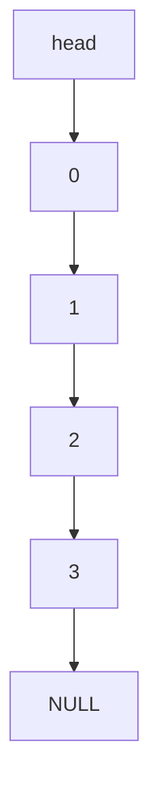
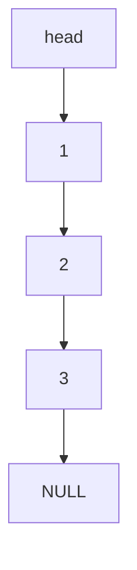

## We have the two methods:

- `.enqueue()` and `.dequeue()`
- Adds a node to end of list; Removes the oldest node in the list.
- FIFO: (First in First Out).

Pre/Post Dequeue




## [[Classes]] Implementation

```cpp
class Queue{

	private:
		Node* head;
		int d;
		Node* tail;
	public;
		Queue(){head=NULL; tail=NULL;}
		Queue(int d){head=NULL; tail=NULL;}
		~Queue(){delete head;}

		void enqueue(int d){
			Node* p = new Node(d);

			if(head==NULL){
				head=p;
				tail=p;
				return;
			}

			tail->setNext(p);
			tail=p;
			
		}
		int dequeue(){
			
			if(head == NULL){
				return -1;
			}
			Node* p = head;
			int d = p->getData();
			head = head->getNext();
			p->setNext(NULL);
			delete p;
			return d;
		
		}
}
```