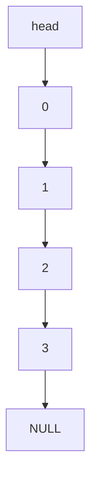
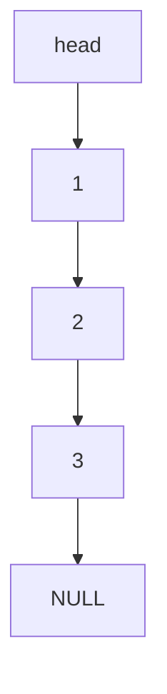

## Variation of [[Linked Lists]]
- Two operations or methods:
    - `.pop()`
    - `.push()`

If we `push()` in a select order to push things into stacks, we will `pop()` in the opposite order.
- LIFO (Last-In, First-Out)

### `pop()` : Remove node that was most recently pushed into list.

### `push()`: Inserts a node at the head of the list.





## head is an important `Node*` as it can take you to all other elements within the stack.

```cpp
class Stack{

	private:
		Node* head;
	public:
		Stack(){head=NULL;}
		~Stack(){
			delete head; // Ends up recursively calling the Destructor for node since
			// we defined a delete next in our Node deconstructor.
		}
		void push(int d){
			// Create a node with data d that the head points to, 
			// will point to the next node that was prev. pointed to by head.
			Node* p = new Node(d, head);
			head = p;
		}
		int pop(){

			if(head==NULL){
				return -1;
			}
			
			Node* p = head;
			head = p -> getNext();
			int d = p->getData();
			
			p -> setNext(NULL); // To prevent delete cascade domino.
			delete p;

			return d;
			
		}

}
```