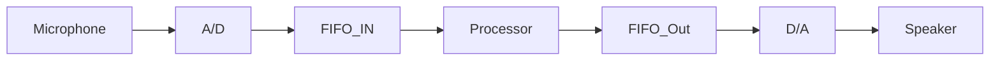

# Note we convert Analog audio (voltage) I/O into Digital signals.

- This happens over time at specified intervals (Sample Rate of [[Continuous Time Signals]]).
- FIFO ([[Queues]]) Buffer Memory after A→D converter and before D→A.



There are two of these. We have a Left channel and a right channel.

# [[Memory-Mapped IO]] registers

|Address| | | | | | |
|---|---|---|---|---|---|---|
|0xff203040|WI (9)|RI (8)|CW(3) → Clear output FIFO|CR(2) → Clear input FIFO|WE(1)|RE(0)|
|0xff203044|WSLC (31→24) → Just like WSRC|WSRC (23→16) → 8bit number telling you how many of the 128 entries of the Right output FIFO we have filled. We can poll this.|RALC (15→8) → Just like RARC|RARC (7→0) → 8bit number telling you how many of the 128 entries of the Right input FIFO we have filled. We can poll this.|||
|0xff203048|Left Data|→|ldwio → gets queue head from input queue.||||
|0xff20304C|Right Data|→|stwio → stores into the output queue tail.||||

# Some C to map this out:

```c
/*******************************************************************************
 * This program performs the following:
 *  1. checks if there is a sample ready to be read.
 * 	2. reads that sample from microphone channels.
 * 	3. writes that sample to the audio output channels.
 ******************************************************************************/
#define AUDIO_BASE			0xFF203040
int main(void) {
    // Audio codec Register address
    volatile int * audio_ptr = (int *) AUDIO_BASE;

    // intermediate values
    int left, right, fifospace;
	
	// This is an infinite loop checking the RARC to see if there is at least a single
	// entry in the input fifos.   If there is, just copy it over to the output fifo.
	// The timing of the input fifo controls the timing of the output

    while (1) {
        fifospace = *(audio_ptr + 1); // read the audio port fifospace register
        if ((fifospace & 0x000000FF) > 0) // check RARC to see if there is data to read
        {
            // load both input microphone channels - just get one sample from each
            int left = *(audio_ptr + 2);
            int right = *(audio_ptr + 3);
			
            // store both of those samples to output channels
            *(audio_ptr + 2) = left;
            *(audio_ptr + 3) = right;
        }
    }
}
```