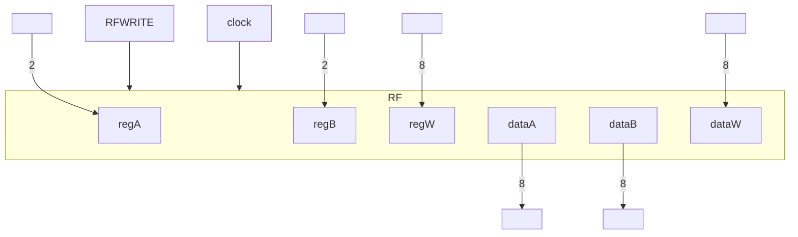
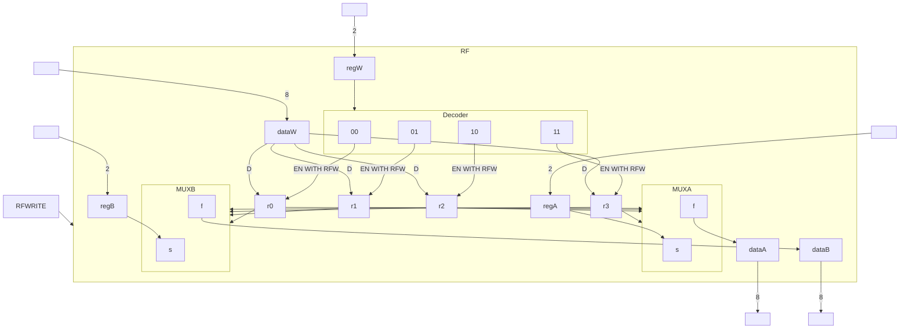

# See [[Flip-Flops]], [[Registers]], [[Multiplexers]].

# The Register File

- A way to access the 4 8-bit registers we have on the [[Simplified Processor]] so we can use them for instructional execution.

- If `RFWRITE` is on, copy `dataW` into `regW`.

# The [[Arithmetic Logic Unit]] on the [[Simplified Processor]]:

|ALUop|ALUout|
|---|---|
|000|A+B|
|001|A-B|
|010|A|
|011|!(A&B)|
|100|A<<B|
|101|A>>B|
|110|reserved|
|111|reserved|
![[IMG_4F18A12FB668-1.jpeg]]
# And The [[Memory]]:

- If `Memread` then after next `posedge clk`: `*address → dataout`
- If `Memwrite` then after next `posedge clk`: `datain → *address`
![[IMG_D214E753E5D4-1.jpeg]]