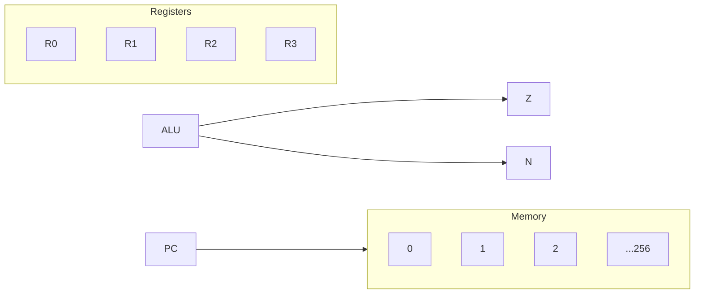

# A simpler processor

- Just 4 registers r0→r3.
- Only 10 instructions.
- 256 Bytes of memory.
- 2-operand instructions only as opposed to three like NIOS II
- We have a program counter (pc)
- Two condition code registers: Z and N.
    - Z: In the previous instruction, was the result 0? if yes, this is 1.
    - N: In the previous instruction, was the result <0? (msb→1)? If yes, this is 1.
    - Used in conditional branch instructions

# Looks like this:
![[Untitled.png]]

# To simplify:

# Consider `add` in this new processor:

`add Ra, Rb`

`Ra ← Ra+Rb

`if (!Ra)Z=1 else 0
`if (Ra<0)N=1 else 0

`pc = pc + 1

## And how it is encoded:

|7|6|5|4|3|2|1|0|
|---|---|---|---|---|---|---|---|
|Ra|→|Rb|→|0|1|0|0|

Where `0100` is the operation code (Op Code) for `add`.

# Considering `sub`:

|7|6|5|4|3|2|1|0|
|---|---|---|---|---|---|---|---|
|Ra|→|Rb|→|0|1|1|0|

Where `0110` is the operation code (Op Code) for `sub`.

# Considering `ori`:

- Immediate constants are encoded within the memory as part of the instruction itself.

In the form:

`ori IMM5`

where IMM5 is a 5 bit constant encoded as:

|7|6|5|4|3|2|1|0|
|---|---|---|---|---|---|---|---|
|IMM5|→|→|→|1|1|1|1|

Having just a 3bit op code.

We do:

`R1 ← R1 | ZE (IMM5)`

where ZE means zero extending IMM5 into 8 bits via concatenation.

`set Z and N`

`pc = pc + 1`

# Considering bitwise `nand`:

`nand Ra, Rb`

|7|6|5|4|3|2|1|0|
|---|---|---|---|---|---|---|---|
|IMM5|→|→|→|1|1|1|1|

Doing:

`Ra←!(Ra&Rb)`

`Z and N are set.`

`pc = pc + 1`

# Memory Operations
- Similar to [[NIOS II Memory Structure]].

## Load:

`load Ra, (Rb)`

Op Code `0000`

Does:

`Ra ← Mem(Rb)`

`pc = pc + 1`

`N, Z are not set`

## Store:

`stw Ra, Rb`

Op Code 0010

Does:

`Ra → Mem(Rb)`

`pc = pc + 1`

`N, Z are not set`

# Conditional Branches

- The branch target address in memory is where the execution should “go” if the condition in the instruction is true.

## Branch not zero `(bnz)`:

`bnz IMM4`

Does:

`if (Z==0): pc ← pc + SE(IMM4)`

`pc ← pc + 1 otherwise`

`Op Code 1001`

Where SE is a sign extend.

- note we have to shift pc as opposed to giving it an absolute value to account for the whole program moving to a different place in memory.

## Branch if positive `(bpz)`:

`bpz IMM4`

Does:

`if (N==0): pc ← pc + SE(IMM4)`

`pc ← pc + 1 otherwise`

`Op Code 1101`

# Shift Operations

shift L/R Ra, Imm2

|7|6|5|4|3|2|1|0|
|---|---|---|---|---|---|---|---|
|Ra|→|L/R|Imm2|→|0|1|1|

Does:

`if (L/R == 1) Ra << Imm2`

`else Ra >> Imm2`