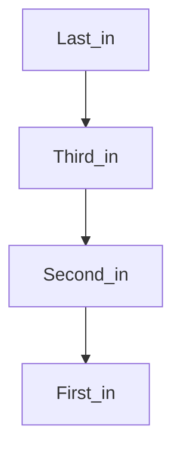

## Definition

- A function/procedure in C
- A method in C++
- APIs, etc.

### They allow us to partition larger software tasks into more sensible pieces.

## Considering the following C-Program:

```c
int mian void(){
	int x, z;
	x=my_sub(3);
	z=my_sub(4);
	return 0;
}
int my_sub(int p){return p+p;}
```

### We will construct an [[Assembly Language]] Equivalent of this and touch on:

- How the ‘return’ statement in my_sub knows where to go after execution.
- How the parameters get passed into the function to begin with. i.e 3/4→p.

Note the following:

1. The processor has another 32bit register called the pc (Program Counter) that always contains the address of the next instruction to be executed as we are executing a given instruction. This is not one of the standard 32 registers. It is another separate one.
2. Register r31 is also called ra (Return Address), and it holds the address to go back to for subroutines.

```nasm
main: movi r4, 3 ;r4<-3 (the parameter sent to my_sub r4 is a good parameter to do this with)
			call my_sub ;ra<-pc so we will return to the instruction after this one when the subroutine finishes
									;pc must also get the value of resl(my_sub) (an address)
next: movi r4, 4
			call my_sub
done: br done
my_sub: add r2, r4, r4
				ret ;pc<-ra so we go to that 'original' next instruction
```

## Nested Subroutines

- ra will be overwritten by the second call, so before we make it we must save the original value of ra so we can get back to our main routine.
- We should store it in memory, and we need a LIFO data structure, like [[Stacks]] to store these calls.

## Review of stacks:



- We can `push` data into the top of the stack (after the last).
- We can `pop` them off the stack (the last comes out).