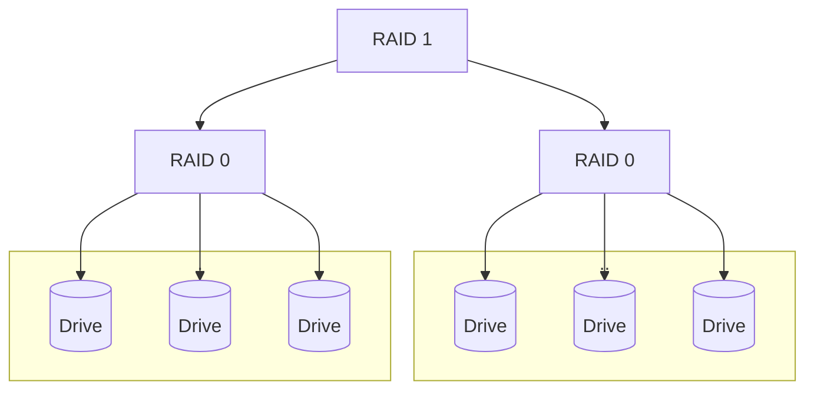
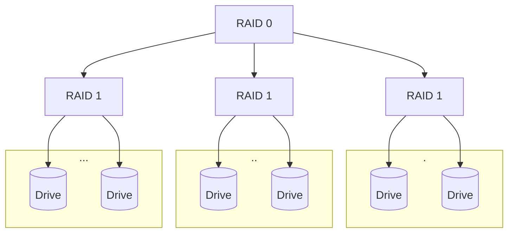

This is a way to practice **Persistence**
- like [[Memory]] but is slower and persists after power cycling

# Solid State Drives (SSDs)
- Organized by [[Page Tables]]
![[Pasted image 20241125122435.png]]
- Assume 4KB pages for this course but they can be any size and dont have to match up with a memory page size (can be larger by a constant factor)
- The `TRIM` Command lets us as the Operating System to inform the SSD that we no longer need a given block of data so it can be erased during idle time so it is hopefully erased for us when we need to write data to it.

Constraints
- must be erased at a block level
- must be erased before we can overwrite

# SLEDs/RAIDs:
- Single Large Expensive Disks or Redundant Array of Independent Disks
- One point of failure for SLED and many for RAID although we have redundancy to prevent data loss.

| **RAID 0** - A Striped Volume                                                                              | **RAID 1** - A Mirrored Volume                                                                                                                                                   | **RAID 4**                                                                                                                                                                                                                                                                                                                                                                                                                                                                                                                                           | **RAID 5**                                                                                                                                                                                                                                                                                      | **RAID 6**                                                                                                                                                                                                                                                                      |
| ---------------------------------------------------------------------------------------------------------- | -------------------------------------------------------------------------------------------------------------------------------------------------------------------------------- | ---------------------------------------------------------------------------------------------------------------------------------------------------------------------------------------------------------------------------------------------------------------------------------------------------------------------------------------------------------------------------------------------------------------------------------------------------------------------------------------------------------------------------------------------------- | ----------------------------------------------------------------------------------------------------------------------------------------------------------------------------------------------------------------------------------------------------------------------------------------------- | ------------------------------------------------------------------------------------------------------------------------------------------------------------------------------------------------------------------------------------------------------------------------------- |
| - Good throughput/performance - Bad Redundancy (none, actually) - $N$ Disks -> $N\times$ performance | - Decent Performance  - Fast Reads and slow writes as we have to write to many places - Excellent Redundancy  - A whole drive or many drives can fail without data loss | - Introduces Parity - Disks 0-2 are Striped like in RAID 0 but the extra disk is there to ensure that if we lose one of them we maintain data integrity - Must have at least 3 drives - We use `XOR` reconstruction here to figure out what bit of info we have lost. - This only works if just one of the other drives fails, and else we have data loss - $N$ Disks -> $(N-1)\times$ performance - Write performance can suffer as we have to write to parity all the time - Usable $(1-\frac{1}{N})\times$ the total storage | - Like RAID 4 but just with distributed Parity this time (better than RAID 4) - Properties are very similar to that of RAID 4 - Write performance is slightly improved and we have a lower chance of wearing out a single parity drive as we now can have many of them to distribute load | - We now have another disk worth full of parity information - Like RAID 5 but just with more redundancy - We can now lose two data disks and still recover/reconstruct the information - Needs at least 4 drives - Usable $(1-\frac{2}{N})\times$ the total storage |
| ![[Pasted image 20241125123202.png]]                                                                       | ![[Pasted image 20241125123724.png]]                                                                                                                                             | ![[Pasted image 20241125124205.png]]                                                                                                                                                                                                                                                                                                                                                                                                                                                                                                                 | ![[Pasted image 20241125125633.png]]                                                                                                                                                                                                                                                            | ![[Pasted image 20241125125910.png]]                                                                                                                                                                                                                                            |
# XOR Reconstruction
- The result of `XOR`-ing three bits is 0 in the case that the sum is even and 1 if odd. Thus we know how to reconstruct the disk array if one of the things from the sum is missing.

# Disk Hierarchies and Combos

- This is a RAID 0+1 Partitioning Scheme

- This is a RAID 1+0 Partitioning Scheme