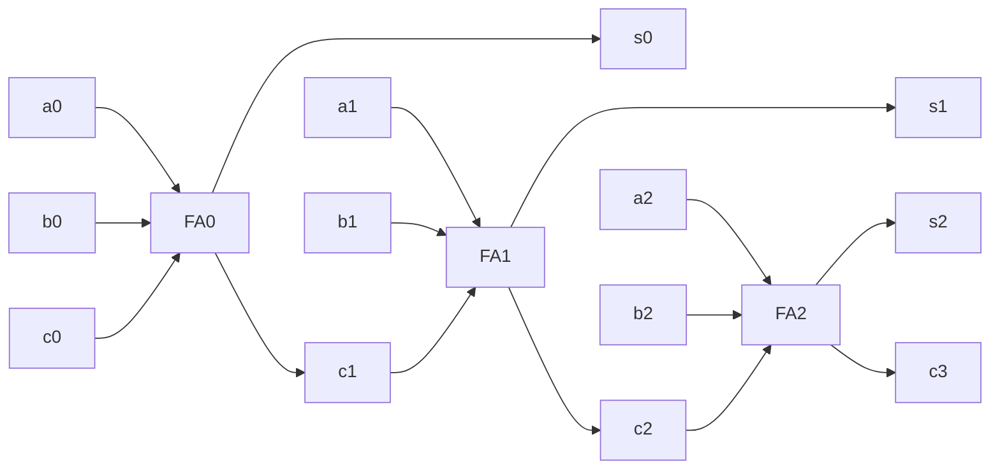

## Adding 2 bits together:

| |1|
|---|---|
|+|1|
|1 (Carry)|0 (Sum)|

|a |b |Sum|Carry|
|---|---|---|---|
|0|0|0|0|
|0|1|1|0|
|1|0|1|0|
|1|1|0|1|

$$ carry = ab $$
$$ sum = a\oplus b $$

## Half adder (HA)
![[IMG_9CEFA92985A7-1.jpeg]]
## Adding 3 1-bit numbers

|$a_i$|$b_i$|$c_i$ (Carry In)|$c{i+1}$ (Carry Out)|$s_i$|
|---|---|---|---|---|
|0|0|0|0|0|
|0|0|1|0|1|
|0|1|0|0|1|
|0|1|1|1|0|
|1|0|0|0|1|
|1|0|1|1|0|
|1|1|0|1|0|
|1|1|1|1|1|

$$ c_{i+1}=a_i*b_i+c_i*a_i+c_i*b_i $$

$$ s_i=a_i\oplus b_i\oplus c_i $$

## Full Adder:
![[IMG_0708.jpg]]
## Combining Full Adders to add Wider Numbers (Carry-Ripple Adder)



## [[Verilog]] Implementation of Carry-Ripple

```verilog
//3-bit Carry-Ripple Adder
module carryripple_adder(A, B, Cin, S, Cout);

	input [2:0] A, B;
	input Cin;
	output [2:0] S;
	output Cout;
	
	wire C1,C2;

	FA bit0(.a(A[0]), .b(B[0]), .cin(Cin), .s(S[0]), .cout(C1));
	FA bit1(.a(A[1]), .b(B[1]), .cin(C1), .s(S[1]), .cout(C2));
	FA bit2(.a(A[2]), .b(B[2]), .cin(C2), .s(S[2]), .cout(Cout));

end module

//Regular Full-Adder
module FA(a, b, cin, s, cout);

	input a, b, cin;
	output s, cout;
	assign cout = (a & b) | (b & cin) | (cin & a)
	assign s = cin ^ a ^ b; // ^ is XOR

end module
```