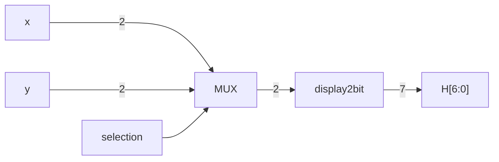
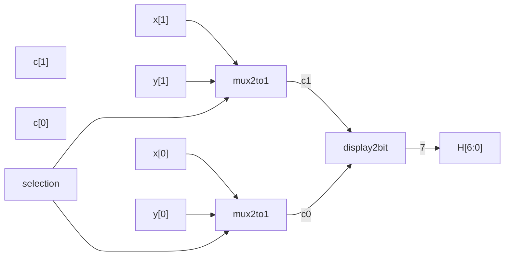

## Displaying a decimal equivalent on a 7-Segment Display:
![[Untitled (1).png]]
### Note: a-g → 0-6 for this example.

We will work on displaying 4 2-bit numbers; Later 16 4-bit numbers ([[Hexadecimals]]).

|x1|x0|Display|s0|s1|s2|s3|s4|s5|s6|
|---|---|---|---|---|---|---|---|---|---|
|0|0|0|1|1|1|1|1|1|0|
|0|1|1|0|1|1|0|0|0|0|
|1|0|2|1|1|0|1|1|0|1|
|1|1|3|1|1|1|1|0|0|1|

|c3|c2|c1|c0|Display|s0|s1|s2|s3|s4|s5|s6|
|---|---|---|---|---|---|---|---|---|---|---|---|
|0|0|0|0|0|1|1|1|1|1|1|0|
|0|0|0|1|1|0|1|1|0|0|0|0|
|0|0|1|0|2|1|1|0|1|1|0|1|
|0|0|1|1|3|1|1|1|1|0|0|1|
|0|1|0|0|4|0|1|1|0|0|1|1|
|0|1|0|1|5|1|0|1|1|0|1|1|
|0|1|1|0|6|1|0|1|1|1|1|1|
|0|1|1|1|7|1|1|1|0|0|0|0|
|1|0|0|0|8|1|1|1|1|1|1|1|
|1|0|0|1|9|1|1|1|1|0|1|1|
|1|0|1|0|A|1|1|1|0|1|1|1|
|1|0|1|1|b|0|0|1|1|1|1|1|
|1|1|0|0|C|1|0|0|1|1|1|0|
|1|1|0|1|d|0|1|1|1|1|0|1|
|1|1|1|0|E|1|0|0|1|1|1|1|
|1|1|1|1|F|0|0|0|1|1|1|1|

## [[Verilog]] Implementation:

```verilog
module display2bit(input x1, x0, output [6:0] s);

	assign s[0] = x1 | ~x0;
	assign s[1] = 1'b1; //1'b1 represents a binary number (bits:1`(binaryflag)value:1)
	assign s[2] = ~x1|x0;
	// s[3]-s[6] ...

end module
```

## Hex display hierarchy example (displayXY):

- x and y are two two-bit numbers.
- Display x if selection = 0 and y otherwise [[Multiplexers]].





## [[Verilog]] Implementation:

```verilog
module mux2to1(x,y,s,f);
	// Definition
end module

module mux2to1_2bit(X,Y,S,F);
	// Definition with mux2to1 instantiation
end module

module display2bit(input x1,x0, output[6:0] s);
	// Definition
end module

module displayXY(input [1:0] X,Y, input sel, output [6:0] H);
	
	wire [1:0]c; //wire keyword for internal connections
	mux2to1_2bit U1(.X(X), .Y(Y), .S(sel), .F(c));
	display2bit U2(.x1(c[1]), .x0(x[0]), .s(H));
 
end module
```