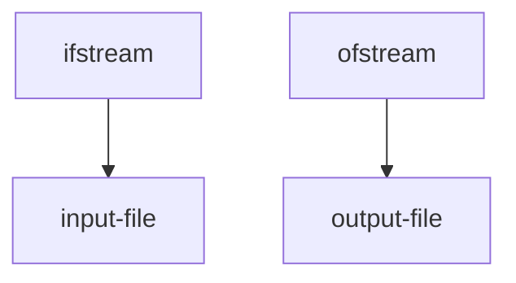

## Standard I/O

```cpp
#include <iostream>
using namespace std;

int main(){
	cout << "Enter yada yada..." << endl;
	int num;
	cin >> num;
	return 0;
}
```

## File I/O



We can write [[Strings in C++]] into files:

```cpp
//Writes the string text into the file myfile.txt in the same directory
#include <fstream>
#include <string>
using namespace std;

int main(){

	ofstream outFile ("myFile.txt", ios::app);
	string text = "we are engineers";

	outFile << text;
	outFile.close(); //Generally this will work as expected for outputs. Like python's open()
	return 0;

}
```

### Input File Stream:

```cpp
#include <fstream>
#include <string>
using namespace std;

int main(){

	ifstream inputFile("myFile.txt"); 
	// note this can be divided: ifstream inputFile; inputFile.open("myFile.txt")
	int num1, num2, num3;
	inputFile >> num1 >> num2 >> num3;
	inputFile.close();
	return 0
	

}
```

```
10 20 30
```

