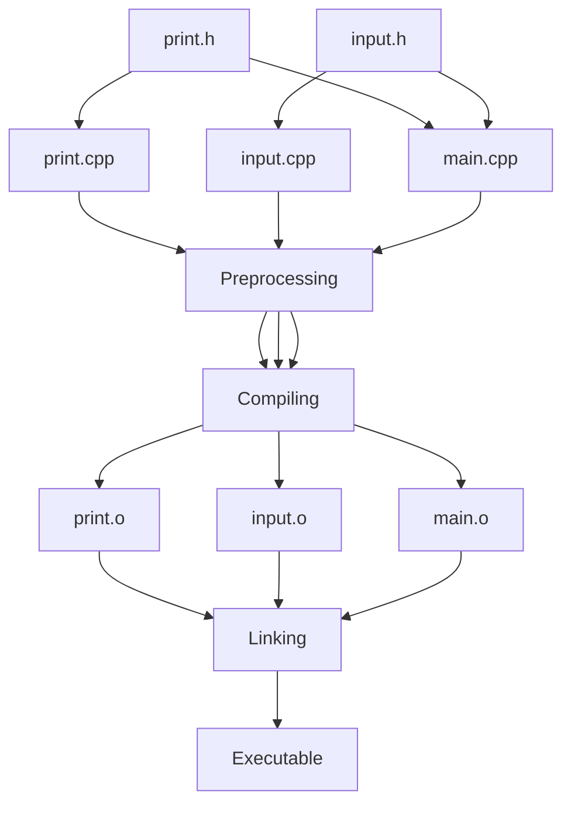

We will convert this cpp file into its modular components.

```cpp
// main.cpp

#include <iostream>
using namespace std;

void printNum(int);
int userInputNum();

int main (){
	int num;
	num = userInputNum();
	printNum(num)
	return 0;
}

void printNum(int num){
	cout << "The number is: " << num << endl;
}

int userInputNum(){

	int x;
	cout << "Enter a number: ";
	cin >> x;
	return x;

}
```

**Compiling main.cpp → exe file: main.exe (binary):** `g++ main.cpp -o main.exe`

```bash
0111 0011 1101 1100 ...
```

# Multiple-File Programs

Source code files including custom [[Header Macros]]:

```cpp
//main.cpp

#include <iostream>
#include "print.h"
#include "input.h"

using namespace std;

int main (){
	int num;
	num = userInputNum();
	printNum(num)
	return 0;
}
```

```cpp
//print.cpp

#include <iostream>
#include "print.h"
using namespace std;

void printNum(int num){
	cout << "The number is: " << num << endl;
}
```

```cpp
//input.cpp
#include <iostream>
#include "input.h"
using namespace std;

int userInputNum(){

	int x;
	cout << "Enter a number: ";
	cin >> x;
	return x;

}
```

## Headers:

```cpp
//print.h

void printNum(int);
```

```cpp
//input.h

int userInputNum();
```

### Overall Structure:



To get the **Executable**:

`g++ main.cpp print.cpp input.cpp -o main`

To **compile only**, without **linking**, add a `-c` flag. For example:

`g++ -c print.cpp` turns `print.cpp` into `print.o`.

Linking is faster than compiling. Thus we should minimize compilation time with Linking.

`g++ main.o print.o input.o -o main`

If we change a `.h` file, we will have to re-compile all files that include that file.